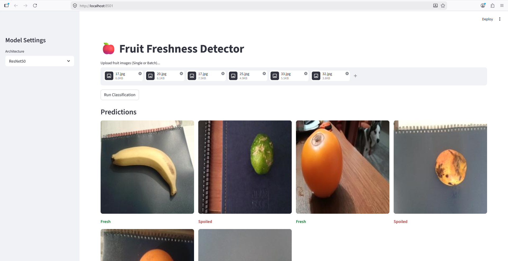
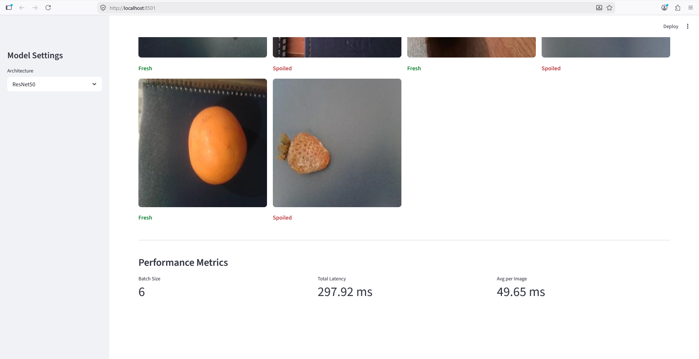
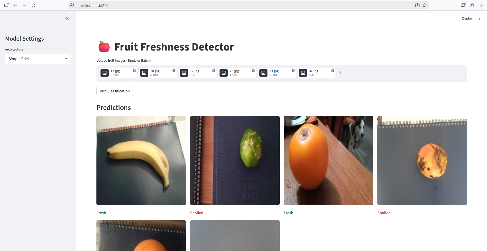
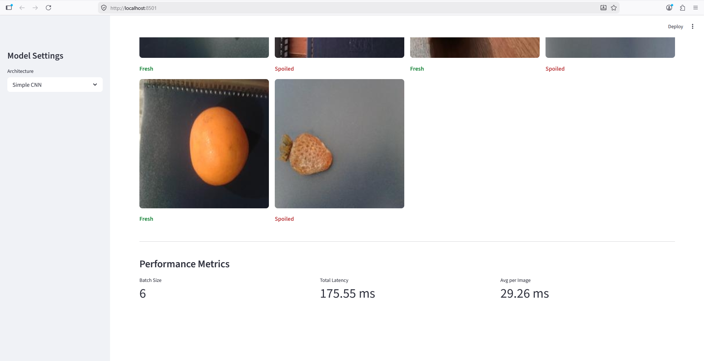

# 🍎 Fruit Freshness Detection: Efficiency vs. Accuracy

## Project Overview

This project is a binary classification system designed to distinguish between **Fresh** and **Spoiled** fruit. It also serves as a comparative study between a lightweight custom architecture and a heavy-duty transfer learning model, focusing on the trade-off between model size, inference speed, and prediction accuracy.

---

## 🚀 Key Features

- **Dual-Architecture Support:** Toggle between a custom **SimpleCNN (1.5 MB)** and a pre-trained **ResNet-50 (90 MB)**.
- **Batch Processing:** Optimized inference pipeline to handle multiple images simultaneously.
- **Latency Tracking:** Real-time performance metrics showing total latency and average time per image in milliseconds.
- **Modern UI:** Streamlit-based interface with drag-and-drop functionality and responsive image grids.
- **Performance Benchmarking:** Compare lightweight and transfer learning approaches side-by-side.

---

## 📸 Application Screenshots

### 🧠 ResNet-50 Interface

| Screenshot 1 | Screenshot 2 |
|---|---|
|  |  |

---

### ⚡ SimpleCNN Interface

| Screenshot 1 | Screenshot 2 |
|---|---|
|  |  |

---

## 📊 Model Comparison

| Metric | SimpleCNN (Custom) | ResNet-50 (Transfer Learning) |
|---|---|---|
| **File Size** | ~1.5 MB | ~90 MB |
| **Accuracy** | 98.83% | 98.12% |
| **Inference Latency** | ~30 ms / image | ~50 ms / image |
| **Architecture Type** | Lightweight CNN | Deep Residual Network |

---

## 🛠️ Technology Stack

- **Framework:** PyTorch
- **UI/Deployment:** Streamlit
- **Image Processing:** Pillow (PIL), Torchvision
- **Version Control:** Git & Git LFS
- **Programming Language:** Python

---

## 📦 Setup & Installation

### 1️⃣ Clone the Repository

```bash
git clone https://github.com/your-username/fruit-freshness-detector.git
cd fruit-freshness-detector
```

### 2️⃣ Install Dependencies

```bash
pip install -r requirements.txt
```

### 3️⃣ Add Model Weights

Place your trained `.pt` files inside the `models/` directory:

```text
models/
├── cnn_fruit_model.pt
└── resnet50_fruit_model.pt
```

### 4️⃣ Run the Application

```bash
streamlit run app.py
```

---

## 📁 Project Structure

```text
fruit-freshness-detector/
│
├── app.py                         # Streamlit UI & application entry
├── predictor.py                   # Model architectures & inference logic
├── requirements.txt               # Project dependencies
├── .gitattributes                 # Git LFS configuration
├── .gitignore                     # Standard Python exclusions
│
├── assets/                        # Application screenshots
│   ├── resnet50_1.png
│   ├── resnet50_2.png
│   ├── simplecnn_1.png
│   └── simplecnn_2.png
│
└── models/                        # Trained model weights
    ├── cnn_fruit_model.pt
    └── resnet50_fruit_model.pt
```

---

## ⚙️ How It Works

1. Upload one or more fruit images through the Streamlit interface.
2. Select the desired model:
   - **SimpleCNN** for lightweight and faster inference
   - **ResNet-50** for higher accuracy
3. The application preprocesses images using Torchvision transforms.
4. Predictions are generated in batches for optimized performance.
5. Results display:
   - Predicted freshness status
   - Confidence score
   - Total latency
   - Average inference time per image

---

## 📌 Future Improvements

- Mobile deployment with TensorFlow Lite / ONNX
- Real-time webcam freshness detection
- Multi-class fruit classification
- Cloud deployment with REST API support
- Model quantization for ultra-fast edge inference
- Dataset expansion with additional fruit categories

---

## ⚠️ Disclaimer

This software is intended for educational and research purposes only. Model predictions may vary depending on lighting conditions, image quality, background clutter, camera angle, and fruit variety.

Always follow proper food safety guidelines before consuming any product.

---

## 🤝 Contributing

Contributions, issues, and feature requests are welcome.

1. Fork the repository
2. Create a feature branch
3. Commit your changes
4. Push the branch
5. Open a pull request

---

## 📜 License

This project is licensed under the MIT License.